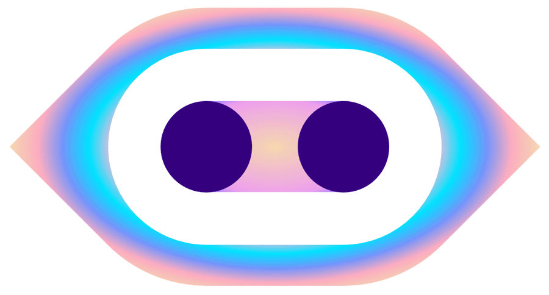

# MIA - My AI Desk Robot
- MIA is a smart, AI-powered robot that can help you with your day-to-day tasks. With its powerful computer vision and natural language processing capabilities, MIA can understand your commands and provide you with personalized assistance.
- Uses OpenAI's Whisper and GPT API to transcribe and respond to conversations
- Uses Google's Sheets API to log data in workbooks

## Features
- Voice control: Use your voice to control MIA and ask it to perform tasks for you.
- Natural language processing: MIA can understand your commands and respond to them appropriately.
- Personalized recommendations: MIA can learn your preferences over time and provide you with personalized recommendations.

## Getting Started
To get started with MIA, follow these steps:
- Clone this repository to your local machine.
- Install the required dependencies using `pip install -r requirements.txt`.
- Run the `test1_main.py` script
- Enjoy using MIA!

## To Be Fixed
- [ ] Sometimes _Date_ column `selfcare_log.csv` gets changed to _index_
- [ ] _Shower_ task occasionally forgets to default to `today` and uses `na`

## Contributing
If you'd like to contribute to MIA, please fork this repository and submit a pull request with your changes. We welcome contributions of all kinds, including bug fixes, new features, and improvements to the documentation.

## Support
If you have any questions or issues with MIA, please email us at [Nikhil Nair](mailto:niknair31898@gmail.com?subject=[MIA-Help]) or visit my [website](https://nikhil-nair.web.app/).

## License
This project is not licensed. Go away.